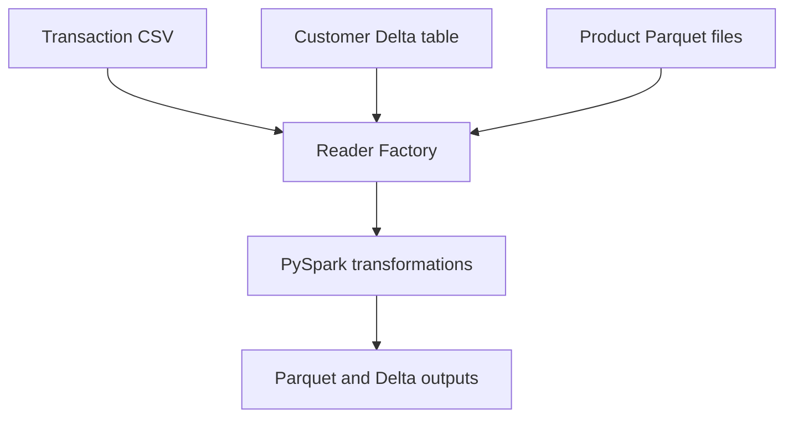

# Apple Purchase Data Analysis with PySpark

[](https://github.com/yasirsavanur/apple-data-analysis-pyspark/actions/workflows/ci.yml)

This is an end-to-end Apache Spark data engineering project built around the small Apple purchase dataset used in Ankur Ranjan's PySpark and Databricks tutorial.

The project does more than place the tutorial code in a notebook. It turns the same business questions into a reusable and tested pipeline with explicit schemas, a Factory Pattern ingestion layer, data quality checks, modular transformations, Parquet and Delta Lake outputs, Databricks notebooks and automated tests.

## What the pipeline answers

1. Which customers bought AirPods immediately after buying an iPhone?
2. Which customers bought only an iPhone and AirPods, with nothing else in their purchase history?
3. What did each customer buy after their first purchase?
4. How many days passed between an iPhone purchase and the immediately following AirPods purchase?
5. Which three products generated the most revenue?

## Verified reference results

The supplied dataset contains 10 transactions, 4 customers and 4 product records.

| Question | Result |
|---|---|
| iPhone followed immediately by AirPods | Customers 105 and 108 |
| Only iPhone and AirPods purchased | Customers 107 and 108 |
| Average delay for the qualifying iPhone to AirPods sequences | 3.5 days |
| Most purchased products | iPhone 4, AirPods 4, MacBook 2 |
| Transactions with an unknown customer | 0 |
| Transactions with an unknown product after standardisation | 0 |

Customer 107 belongs in the second result because the condition checks the complete purchase set, not the order. That customer bought AirPods and then an iPhone. Customer 107 does not belong in the first result because AirPods did not come immediately after the iPhone.

## Architecture



The raw files are prepared into three source formats on purpose. This demonstrates how one pipeline can read operational data from different storage types through the same interface.

```text
Raw CSV files
    |
    |-- transactions remain CSV
    |-- customers become Delta
    `-- products become Parquet
             |
             v
        Reader Factory
             |
             v
    validation and transformations
             |
             v
      analytics-ready outputs
```

## A source data issue handled openly

The public tutorial dataset names products differently across its files. For example, the product master contains `iPhone SE`, `AirPods Pro` and `MacBook Air`, while the transaction file contains `iPhone`, `AirPods` and `MacBook`.

This repository keeps the raw files unchanged. During source preparation, those three product names are standardised to the transaction vocabulary. The original product name is retained in `source_product_name`, so the correction is visible and auditable. Without this step, a product join against the public files would match no rows. Quietly replacing the raw product file would make the demo look cleaner, but it would hide a real data quality problem.

## Project structure

```text
.
|-- data/raw/                    Exact tutorial-style CSV files
|-- docs/                        Data dictionary and expected results
|-- notebooks/                   Databricks-ready Python notebooks
|-- scripts/                     Dependency-free reference validation
|-- src/apple_data_analysis/     Reusable PySpark package
|-- tests/                       Unit and end-to-end Spark tests
|-- .github/workflows/ci.yml     Automated Spark and Delta verification
|-- pyproject.toml               Package and dependency configuration
`-- README.md
```

## Main engineering features

- explicit Spark schemas instead of automatic type inference
- CSV, Parquet and Delta Lake readers behind a Factory Pattern
- deterministic customer purchase ordering using a Spark window
- `lead()` for immediate next-purchase analysis
- `collect_set()` for exact product-set analysis
- `row_number()` and ordered arrays for subsequent purchases
- broadcast joins for the small customer and product dimensions
- data quality checks for nulls, duplicate keys and unmatched dimensions
- Parquet and Delta Lake output loaders
- repeatable command-line and Databricks execution
- unit tests plus a full mixed-source integration test

## Run locally

### Prerequisites

- Python 3.10 or 3.11
- Java 17

Spark 3.5 supports Java 17. Delta Lake 3.3 is compatible with Spark 3.5.

### Setup

```bash
python -m venv .venv
source .venv/bin/activate
python -m pip install --upgrade pip
python -m pip install -e ".[dev]"
```

### Run the complete pipeline

```bash
apple-analysis all \
  --raw-dir data/raw \
  --work-dir build \
  --output-dir outputs
```

The command performs both stages:

1. Convert the customer source to Delta and the cleaned product source to Parquet.
2. Read CSV, Delta and Parquet through the Reader Factory, validate the data, run every workflow and write the results.

### Run the tests

```bash
pytest -q
```

### Check the expected answers without Spark

```bash
python scripts/validate_reference_results.py
```

This last script uses only the Python standard library. It is useful for checking the expected business answers before setting up Java and Spark. It is not a substitute for the Spark integration test.

## Run in Databricks

1. Create a folder in a Unity Catalog volume, for example `/Volumes/main/default/apple_data/raw`.
2. Upload the three files from `data/raw/` into that folder.
3. Import or clone this repository into a Databricks Git folder.
4. Open `notebooks/01_prepare_sources.py` and set the volume paths in the widgets.
5. Run the notebooks in this order:

```text
01_prepare_sources.py
02_run_pipeline.py
03_spark_optimisation.py
```

The third notebook is explanatory. It displays partition counts and physical plans for repartitioning, coalescing, predicate pushdown and broadcast joins.

## Output tables

| Output | Format | Purpose |
|---|---|---|
| `iphone_then_airpods` | Parquet | Customers whose immediate next purchase after an iPhone was AirPods |
| `only_iphone_airpods` | Delta | Customers whose full product set was exactly iPhone and AirPods |
| `subsequent_purchases` | Parquet | First purchase and ordered later purchases for every customer |
| `average_purchase_delay` | Parquet | Average days between the qualifying iPhone and AirPods purchases |
| `top_products` | Parquet | Top three products ranked by revenue |

## What this project demonstrates

For a recruiter or hiring manager, the useful part is the structure around the analysis. The project shows how to take several file formats, apply validation before transformation, separate extraction from business logic, make output choices explicit and test the full path rather than relying on screenshots from a notebook.

The dataset itself is deliberately tiny and synthetic. The numerical findings should therefore be treated as proof that the pipeline behaves correctly, not as meaningful evidence about real Apple customers.

## Learning source and data provenance

The business questions and sample data follow the public tutorial project introduced in [Apache Spark End-To-End Data Engineering Project | Apple Data Analysis](https://www.youtube.com/watch?v=BlWS4foN9cY). The raw CSV values were cross-checked against public implementations of that tutorial, including [this repository](https://github.com/ankitsahoo/Apache-Spark-End-To-End-Data-Engineering-Project-Apple-Data-Analysis).

The package, validation layer, tests, command-line workflow and documentation in this repository are an original rebuild rather than a copy of another implementation.
